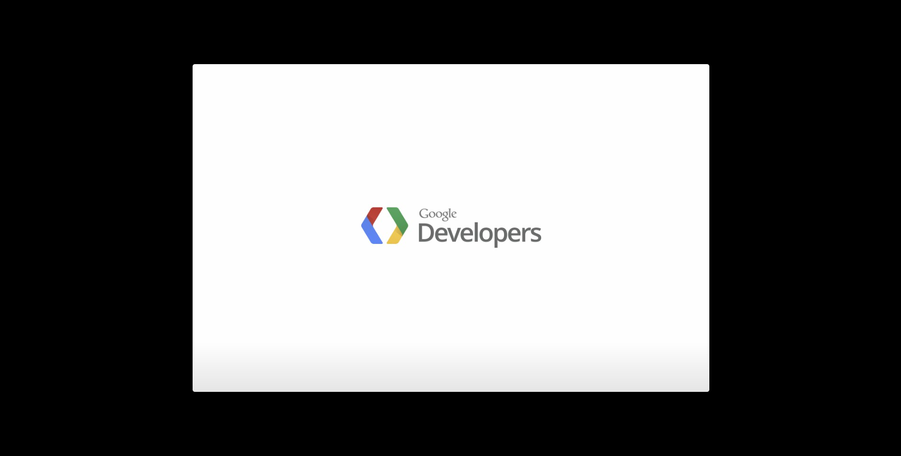

# Note0829


<!-- MarkdownTOC -->

- [典型的 JavaScript 面试题 -- 概念](#典型的-javascript-面试题----概念)
  - [how does `this` works](#how-does-this-works)
    - [全局上下文](#全局上下文)
    - [函数上下文](#函数上下文)
    - [`bind()` 用法](#bind-用法)
    - [箭头函数](#箭头函数)
    - [作为 Object](#作为-object)
      - [原型链中的 `this`](#原型链中的-this)
      - [`this` in `getter` & `setter`](#this-in-getter--setter)
    - [作为构造函数](#作为构造函数)
    - [作为 DOM 事件处理函数](#作为-dom-事件处理函数)
    - [作为内联事件](#作为内联事件)
  - [how to use `bind()`](#how-to-use-bind)
    - [语法和参数](#语法和参数)
    - [用法1 - 创建绑定函数](#用法1---创建绑定函数)
    - [用法2 - 预设函数初始值](#用法2---预设函数初始值)
    - [用法3 - 配合 `setTimeout()` 使用](#用法3---配合-settimeout-使用)
    - [支持版本](#支持版本)
- [`` type 值](#-type-值)
- [sublime package - sublimetext-markdown-slideshow](#sublime-package---sublimetext-markdown-slideshow)
  - [how to start](#how-to-start)
  - [体验](#体验)

<!-- /MarkdownTOC -->


## 典型的 JavaScript 面试题 -- 概念

[explained](https://www.maxpou.fr/js-exercises-explained/)

[原文](https://performancejs.com/post/hde6d32/The-Best-Frontend-JavaScript-Interview-Questions-%28written-by-a-Frontend-Engineer%29)

[let's code JavaScript](http://www.letscodejavascript.com/)

一般的面试题分为：概念、编码、调试、系统设计，四个部分，Boris Cherny 的这些问题都十分有意思，可以留作日常一题进行实现


### how does `this` works


#### 全局上下文

无论是否在严格模式下，在全局执行上下文中（在任何函数体外部）`this` 都指代全局对象。

```javascript
// 在浏览器中, window 对象同时也是全局对象：
console.log(this === window); // true

a = 37;
console.log(window.a); // 37
```

#### 函数上下文

代码不在 strict mode 下，且 `this` 的值不是由该调用设置的，所以 `this` 的值默认指向全局对象。

与 strict mode 相对的是 sloppy mode

```javascript
function f1(){
  return this;
}
//在浏览器中：
f1() === window;   //在浏览器中，全局对象是window
```

然而在 strict mode 中，值 `this` 保留在输入执行上下文时设置的值，因此，在下面的示例中，`this` 将默认为 `undefined` :

```javascript
function f2() {
  'use strict'; // see strict mode
  return this;
}

f2() === undefined; // true
```

因此，在 `strict mode` 下，  如果 `this` 未由执行上下文定义，则它仍未定义。

要将值 `this` 从一个上下文传递到另一个上下文，请使用  `call` 或  `apply` ：

```javascript
// An object can be passed as the first argument to call or apply and this will be bound to it.
var obj = {a: 'Custom'};

// This property is set on the global object
var a = 'Global';

function whatsThis() {
  return this.a;  // The value of this is dependent on how the function is called
}

whatsThis();          // 'Global'
whatsThis.call(obj);  // 'Custom'
whatsThis.apply(obj); // 'Custom'
```

:red_circle: 使用 `call` 和 `apply` ，如果传递的值 `this` 不是对象，则将尝试使用内部 `ToObject` 操作将其转换为对象。

```javascript
function bar() {
  console.log(Object.prototype.toString.call(this));
}

bar.call(7);     // [object Number]
bar.call('foo'); // [object String]
```

#### `bind()` 用法


:red_circle: 调用 f.bind(someObject) 创建一个具有相同主体和范围的新函数f，但在 `this` 原始函数中发生的情况下，在新函数中，它将永久绑定到 **第一个参数** `bind`，无论函数如何使用。

```javascript
function f() {
  return this.a;
}

var g = f.bind({a: 'azerty'});
console.log(g()); // azerty

var h = g.bind({a: 'yoo'}); // bind only works once!
console.log(h()); // azerty

var o = {a: 37, f: f, g: g, h: h};
console.log(o.a, o.f(), o.g(), o.h()); // 37,37, azerty, azerty
```


#### 箭头函数

```javascript
var globalObject = this; //this -> Window{}
var foo = (() => this);
// run evn
// var fop = (function(){return this;})();

foo() === globalObject; // true

// Call as a method of an object
var obj = {func: foo};
obj.func() === globalObject; // true

// Attempt to set this using call
foo.call(obj) === globalObject; // true

// Attempt to set this using bind
foo = foo.bind(obj);
foo() === globalObject; // true
```

#### 作为 Object

```javascript
// normally 
var o = {
  prop: 37,
  f: function() {
    return this.prop;
  }
};

console.log(o.f()); // 37

// the same
var o = {prop: 37};

function independent() {
  return this.prop;
}

o.f = independent;

console.log(o.f()); // 37
```

##### 原型链中的 `this`

```javascript
var o = {
  f: function() { 
    return this.a + this.b; 
  }
};
// creat f() in __proto__
var p = Object.create(o);
p.a = 1;
p.b = 4;

console.log(p.f()); // 5
```

##### `this` in `getter` & `setter`

```javascript
function sum() {
  return this.a + this.b + this.c;
}

var o = {
  a: 1,
  b: 2,
  c: 3,
  get average() {
    return (this.a + this.b + this.c) / 3;
  }
};

Object.defineProperty(o, 'sum', {
    get: sum, enumerable: true, configurable: true});

console.log(o.average, o.sum); // logs 2, 6
```

#### 作为构造函数

```javascript
function C(){
  this.a = 37;
}

var o = new C();
console.log(o.a); // logs 37


function C2(){
  this.a = 37;
  return {a:38};
}

o = new C2();
console.log(o.a); // logs 38
```

`C2()` 中构造函数中手动设置了返回值，导致 `this` 绑定的默认对象丢失（这基本上使得语句 `this.a = 37;` 成了“僵尸”代码，实际上并不是真正的“僵尸”，这条语句执行了，但是对于外部没有任何影响）

#### 作为 DOM 事件处理函数

```javascript
// 被调用时，将关联的元素变成蓝色
function bluify(e){
  console.log(this === e.currentTarget); // 总是 true

  // 当 currentTarget 和 target 是同一个对象时为 true
  console.log(this === e.target);        
  this.style.backgroundColor = '#A5D9F3';
}

// 获取文档中的所有元素的列表
var elements = document.getElementsByTagName('*');

// 将bluify作为元素的点击监听函数，当元素被点击时，就会变成蓝色
for(var i=0 ; i<elements.length ; i++){
  elements[i].addEventListener('click', bluify, false);
}
```

#### 作为内联事件

```javascript
<button onclick="alert(this.tagName.toLowerCase());">
  Show this
</button>
```

alert 显示的是 `button` 

```javascript
<button onclick="alert((function(){return this})());">
  Show inner this
</button>
```

在这种情况下，没有设置内部函数的 `this` ，所以它指向 global/window 对象

alert 显示的是 `[object Window]`


### how to use `bind()`


`bind()` 函数会创建一个新函数（称为绑定函数），新函数与被调函数（绑定函数的目标函数）具有相同的函数体。

#### 语法和参数

```javascript
fun.bind(thisArg[, arg1[, arg2[, ...]]])
```

`thisArg`

当绑定函数被调用时，该参数会作为原函数运行时的 `this` 指向。当使用 `new` 操作符调用绑定函数时，该参数无效。

`arg1, arg2, ...`

当绑定函数被调用时，这些参数将置于实参之前传递给被绑定的方法。

返回值由指定的 `this` 值和初始化参数改造的原函数拷贝

#### 用法1 - 创建绑定函数

`bind()` 最简单的用法是创建一个函数，使这个函数不论怎么调用都有原函数同样的 `this` 值。

```javascript
var module = {
  x: 42,
  getX: function() {
    return this.x;
  }
}

var unboundGetX = module.getX;
console.log(unboundGetX()); // The function gets invoked at the global scope
// expected output: undefined

var boundGetX = unboundGetX.bind(module);
console.log(boundGetX());
// expected output: 42
```

#### 用法2 - 预设函数初始值


`bind()` 的另一个最简单的用法是使一个函数拥有预设的初始参数。

这些参数（如果有的话）作为 `bind()` 的第二个参数跟在 `this`（或其他对象）**后面**，之后它们会被插入到目标函数的参数列表的开始位置，传递给绑定函数的参数会跟在它们的 **后面**。

```javascript
function list() {
  return Array.prototype.slice.call(arguments);
}

var list1 = list(1, 2, 3); // [1, 2, 3]

// Create a function with a preset leading argument
var leadingThirtysevenList = list.bind(undefined, 37);

var list2 = leadingThirtysevenList(); // [37]
var list3 = leadingThirtysevenList(1, 2, 3); // [37, 1, 2, 3]
```

#### 用法3 - 配合 `setTimeout()` 使用


在默认情况下，使用 `window.setTimeout()` 时，`this` 关键字会指向 `window` （或全局）对象。当使用类的方法时，需要 `this` 引用类的实例，你可能需要显式地把 `this` 绑定到回调函数以便继续使用实例。

```javascript
function LateBloomer() {
  this.petalCount = Math.ceil(Math.random() * 12) + 1;
}

// Declare bloom after a delay of 1 second
LateBloomer.prototype.bloom = function() {
  window.setTimeout(this.declare.bind(this), 1000);
};

LateBloomer.prototype.declare = function() {
  console.log('I am a beautiful flower with ' +
    this.petalCount + ' petals!');
};

var flower = new LateBloomer();
flower.bloom();  // 一秒钟后, 调用'declare'方法
```

#### 支持版本

`bind()` 函数在 ECMA-262 第五版才被加入, 可以添加小段 JavaScript 代码让不支持的浏览器也支持 `bind()` 用法


## `<input type="" value="page" />` type 值


in


## sublime package - sublimetext-markdown-slideshow

[document of ogom / sublimetext-markdown-slideshow](https://ogom.github.io/sublimetext-markdown-slideshow/docs/)

### how to start

1、 package install sublimetext-markdown-slideshow

2、 new markdown file，print in


```markdown
# Title

Content

<!--
  Note
-->

----

Next content

____

## String of small content

Content
```

3、 use <kbd>alt</kbd> + <kbd>s</kbd>

it works the same as

```html
<slide>
  <hgroup>
    <h1>Title</h1>
  </hgroup>
  <article class="none">
    <p>Content</p>
    <aside class="note">
      Note
    </aside>
  </article>
</slide>

<slide>
  <hgroup>
    <p>Next content</p>
  </hgroup>
</slide>

<slide>
  <hgroup>
    <h2>String of small content</h2>
  </hgroup>
  <article class="smaller">
    <p>Content</p>
  </article>
</slide>
```



这个界面是真的合乎我的胃口，幻灯片切换只需方向键 <kbd>←</kbd> <kbd>→</kbd> 控制即可，也可以点击页面中左右黑色的部分。

调整图像大小
在 `` 标签中设置宽度和高度的属性。

`{:width="100px"}`

效果等同于：

```html
<p></p>
```

### 体验

但是不足还是很明显的，最新的版本还是 2012 ，没有继续开发，兼容性难以保证（我 win10 + sublime 3 没有问题）；可选的主题太少，只有 io2012 和 io2011

考虑自己写个主题，添加全屏模式，参考之前的 [REVEAL.JS](https://revealjs.com/#/)有线上网站，非常酷炫 [在线编辑网站](https://slides.com/)，主要是 [reveal 开源](https://github.com/hakimel/reveal.js)主题 :innocent:

这对于快速反应的 presentation 还是很有帮助的，主要基于演讲者的演讲内容，而不是花里胡哨的 PPT 表现形式。移植到别的平台只要在我上传 sublime-markdown-slideshow 生成的 web 文件之后，访问即可 :wink:

代码写 PPT 的体验还是很舒服的

其实也可以用作个人介绍页，面试求职的时候可以摆出来，通过聊这个求职个人介绍页的实现，了解我所掌握的技术，构建一个我比较全面的形象。

- 精通 markdown 写作，以及 markdown 其他衍生功能
- sublime 编辑器的个人开发相关 package 的分支版本开发
- 前端全面的技能，个人网站 gitpage + markdown 以及 revael.js 的二次开发
- git 版本控制工具的使用，社区声望比较高
- 具有自主学习能力，，思维发散能力比较强，对自己有个比较全面的认识


