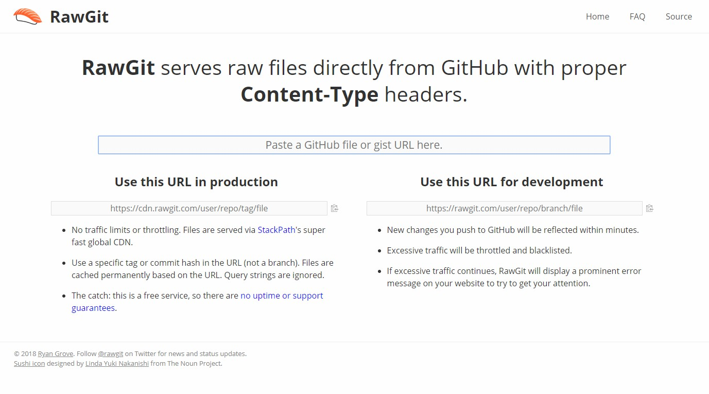
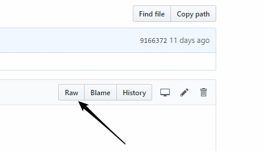

# Note0904


<!-- MarkdownTOC -->

- [RawGit](#rawgit)
    - [Use this URL in production](#use-this-url-in-production)
    - [Use this URL for development](#use-this-url-for-development)
    - [:clown_face: 邪门歪道](#clown_face-邪门歪道)
    - [托管 stl 文件](#托管-stl-文件)
- [带链接的图片 markdown](#带链接的图片-markdown)
- [典型的 JavaScript 面试题 -- 编程](#典型的-javascript-面试题----编程)
    - [You-Dont-Know-JS](#you-dont-know-js)
- [伪类 before & after](#伪类-before--after)
- [flex](#flex)
- [形变 transform](#形变-transform)
- [canvas css 实验](#canvas-css-实验)

<!-- /MarkdownTOC -->


## RawGit

由于在 github 上托管了不少东西，有时候就会想要用 url 的形式调用 github 上的文件，这时候你会发现直接贴文件 url 是不可行的。

有个网站专门解决这个问题：


[](https://rawgit.com/)

但是要注意两种不同 URL 的使用限制

### Use this URL in production

- 没有流量限制或限制。文件通过StackPath的超快速全局CDN提供。

- 在URL（不是分支）中使用特定标记或提交哈希。根据URL永久缓存文件。查询字符串被忽略。

- 问题：这是免费服务，因此没有正常运行时间或支持保证。


### Use this URL for development

- 推送到GitHub的新更改将在几分钟内反映出来。

- 过多的流量将被限制并列入黑名单。

- 如果流量持续过多，RawGit会在您的网站上显示一条突出的错误消息，以引起您的注意。


### :clown_face: 邪门歪道



注意到在库内文件预览左上角就有 raw 的选项

点击后复制网址，但是要设置 Content-Type ，如果是 css 文件就设置 text/css 如此

可是其他文件，例如图片，不能用这种办法。 :upside_down_face:

### 托管 stl 文件

注意到之前在 [Note0819](./Note0819.md) 中提到托管 .stl 文件

<iframe height="420" width="900" frameborder="0" src="https://render.githubusercontent.com/view/3d?url=https://raw.githubusercontent.com/b1uuue/zNote/master/image/spider.stl" title="spider.stl"> </iframe>

代码如下：

```html
<iframe height="420" width="900" frameborder="0" src="https://render.githubusercontent.com/view/3d?url=https://raw.githubusercontent.com/b1uuue/zNote/master/image/spider.stl" title="spider.stl"> </iframe>
```
其中 url 后面直接贴文件的 url 即可，当然你可以定义这个 `<iframe>` 的一些属性 :sweat_smile:

当然，就想同目录下的文件是否可以直接调用，代码改写成：

```html
<iframe height="420" width="900" frameborder="0" src="https://render.githubusercontent.com/view/3d?url=../image/spider.stl" title="spider.stl"> </iframe>
```

未找到解决办法 :upside_down_face:


## 带链接的图片 markdown

纯 markdown 格式如下：

```markdown
[](link)
```

以后链接都可能附在图片上 :thinking:

当然你也可以用 html 实现 whatever


## 典型的 JavaScript 面试题 -- 编程

[explained](https://www.maxpou.fr/js-exercises-explained/)

[原文](https://performancejs.com/post/hde6d32/The-Best-Frontend-JavaScript-Interview-Questions-%28written-by-a-Frontend-Engineer%29)

[let's code JavaScript](http://www.letscodejavascript.com/)

一般的面试题分为：概念、编码、调试、系统设计，四个部分，Boris Cherny 的这些问题都十分有意思，可以留作日常一题进行实现

### You-Dont-Know-JS

[](https://github.com/getify/You-Dont-Know-JS)

内容总结为 .md 文件，非常方便我浏览

里面部分 markdown link 存在问题 `/` 转义

`%20` 代表空格

["Up & Going"](up%20&%20going/README.md)


## 伪类 before & after


## flex

## 形变 transform

## canvas css 实验

联系之前的小球碰撞，修改

[bacterium](https://lab.hakim.se/bacterium/01/)

it's a really interesting work 