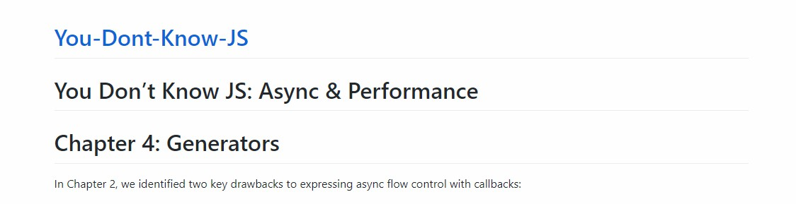

# Note0905

<!-- MarkdownTOC -->

- [当幸福来敲门](#当幸福来敲门)
- [亲情的纽带是什么](#亲情的纽带是什么)
- [markdown 链接问题](#markdown-链接问题)
    - [`#` 大标题自连接](#-大标题自连接)
    - [下层文件夹 `README.md` 链接](#下层文件夹-readmemd-链接)

<!-- /MarkdownTOC -->

## 当幸福来敲门

## 亲情的纽带是什么


## markdown 链接问题

在浏览，修改 You-Dont-Know-JS 过程中发现一些 markdown 中 link 的注意点。

### `#` 大标题自连接

注意到 You-Dont-Know-JS 标题的命名：

```markdown
# You Don't Know JS: Async & Performance
# Chapter 4: Generators
```

在 gitpage 中预览的时候显示的效果是这样的：

[](https://b1uuue.github.io/You-Dont-Know-JS/async%20&%20performance/ch4.html)

注意到，蓝字是链接 :link: 点击回到最外层的 `index.html` 我很想知道这是怎么实现的。 :kissing:


### 下层文件夹 `README.md` 链接

注意到，当前文件夹没有 `index.html` 的时候，`README.md` 会充当首页的角色。

那么，如果你想链接到下一层目录的首页，就可以不用特别指明链接到下一层的 `README.md`，特别指明的话会 `404` :upside_down_face:

就比如我的文件目录是这样的：

```markdown
|---book
    |---book-1
    |---book-2
        |---book-2.1
        |---book-2.2
        |---book-2.3
        |---README.md
    |---book-3
    |---README.md
```

在 `book` 的 `README.md` 中有个链接到 `book2` 的 `README.md` 的链接，那么在 `book` 的 `README.md` 中就可以这样写：

```markdwon
[book-2](./book-2)
```

这样一修改就可以愉快地在 gitpage 上阅读了

[](https://b1uuue.github.io/You-Dont-Know-JS/)


```html
<!DOCTYPE html>
<html>
<head>
    <title></title>
</head>
<body>

</body>
</html>
```
