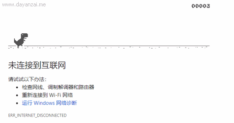

# Note0906


<!-- MarkdownTOC -->

- [chrome dinosaur](#chrome-dinosaur)
- [flexbox basic](#flexbox-basic)
    - [flexbox-direction](#flexbox-direction)
    - [display:flex](#displayflex)
    - [flex-wrap](#flex-wrap)
    - [flex-flow](#flex-flow)
    - [Controlling the Ratios](#controlling-the-ratios)
    - [flex预定义值](#flex预定义值)
    - [align-items](#align-items)
    - [justify-content](#justify-content)
- [input type = number](#input-type--number)

<!-- /MarkdownTOC -->


## chrome dinosaur

Chrome 十周年版本更新，彩蛋 Dinosaur 戴上了小帽子哈哈哈 :smile:

[](https://www.google.com/)


## flexbox basic

[](https://developer.mozilla.org/en-US/docs/Glossary/Flexbox)

Flexible Box 通常简称为 flexbox 被设计为一维布局模型，并且可以提供界面中项目之间的空间分布和强大的对齐功能。

> 当我们将flexbox描述为一维时，我们描述的事实是flexbox一次处理一个维度的布局 - 无论是行还是列。这可以与CSS Grid Layout的二维模型形成对比，后者将列和行控制在一起。

### flexbox-direction

主轴 `flex-direction` 有四个可能的值：

- `row`
- `row-reverse`
- `column`
- `column-reverse`

横轴的方向与主轴垂直

众所周知英语和阿拉伯语的写作方向是水平的，但是英语是从左到右书写，阿拉伯语是从右到左书写，分布方向 reverse 可以很好的处理这种情况

### display:flex

创建 flex 容器，可以设置 `display:flex` 或 `display:inline-flex`

### flex-wrap

`flex-wrap:wrap`

如果项目太大，不能显示在同一行中，那么他们将分布到另一行中。

`flex-wrap:nowarp`

他们将按比例缩小，以适应容器。但是，如果物品不能收缩，或者收缩不够小，不适合使用会导致溢出。


### flex-flow

结合两个属性 flex-direction ，并 flex-wrap 为 flex-flow 速记。指定的第一个值是 flex-direction ，第二个值是 flex-wrap ，例如：

```css
.box {
    display: flex;
    flex-flow: row wrap;
}
```

### Controlling the Ratios

可以等效于剩余空间分配

`flex-grow`

这是根据作为可用空间留下的空间来定义该项目的大小。此属性的初始值是 auto 在这种情况下，浏览器会查看项目是否具有大小。

`flew-shrink`

属性设置为正整数后，将按照值的大小按比例分配剩余空间

`flex-basis`

如果我们在容器中没有足够的空间来布置我们的项目，并且 flex-shrink 设置为正整数后，具有更高值设置的项目 flex-shrink 将比具有更低值的兄弟项目缩小得更快。

当然这三个值也存在速记，对应的顺序是 flex-grow flex-shrink flex-basis 例子如下：

```html
<div class="box">
    <div class="one">One</div>
    <div class="two">Two</div>
    <div class="three">Three</div>
</div>
    
```

```css
 .box {  
    display: flex;
}
.one {
    flex: 1 1 auto;
}
.two {
    flex: 1 1 auto;
}
.three {
    flex: 1 1 auto;
}
```

### flex预定义值

`flex:initial`

将会初始化 Flexbox 的值，即 `flex: 0 1 auto` ，子元素不会填充容器，但是会在需要时收缩

flex-grow = 0，因此项目不会大于其 flex-basis 大小。

值为 flex-shrink = 1，因此如果需要而不是溢出，则项目可以缩小。

flex-basis 是 auto 。项目将使用主要维度中项目的任何大小设置，或者他们将从内容大小获取其大小。

`flex:auto`

即 `flex: 1 1 auto` 在这种情况下，子元素可以拉伸并填充容器，并在需要时收缩。

`flex: none`

即 `flex: 0 0 auto` ，该项目无法放大或缩小，但将使用 Flexbox 的一个进行布局 flex-basis 的 auto

`flex: 1..3`

这些项目可以从flex-basis0开始增长和缩小


### align-items

对齐横轴上的项目

- stretch
- flex-start
- flex-end
- center

stretch 将 flex 项目默认伸展到最高属性的高度，其他属性顾名思义

### justify-content

用于排布主轴上的项目

- flex-strat 无间隙排布到头
- flex-end 无间隙排布到尾
- center 无间隙排布到中间
- space-around 两端间隙略小
- space-between 仅中间有间隙
- space-evenly 平均间隙

## input type = number

-webket-appearence: none;
