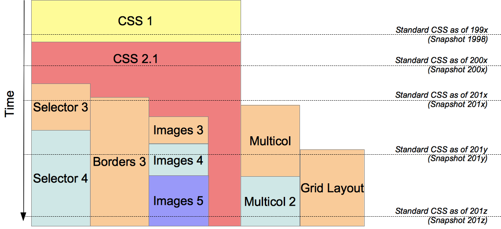

# Note0910


<!-- MarkdownTOC -->

- [UML-ClassDiagram](#uml-classdiagram)
    - [组成](#组成)
    - [继承](#继承)
    - [简单关联](#简单关联)
    - [聚合](#聚合)
    - [成分](#成分)
    - [依赖性](#依赖性)
- [sublime 自定义代码段](#sublime-自定义代码段)
    - [how to start](#how-to-start)
    - [SAVE](#save)
    - [SASS Snippets](#sass-snippets)
- [CSS3](#css3)
    - [CSS3 历史](#css3-历史)
    - [CSS 模块](#css-模块)
- [选择器](#选择器)
- [伪选择器](#伪选择器)
- [flexbox 和其他 CSS 的区别](#flexbox-和其他-css-的区别)

<!-- /MarkdownTOC -->


## UML-ClassDiagram

类似于 yml 的 UML 编辑平台，支持外部链接

[PlantText](https://www.planttext.com/)

[what-is-uml](https://www.visual-paradigm.com/guide/uml-unified-modeling-language/what-is-uml/)

[what-is-class-diagram](https://www.visual-paradigm.com/guide/uml-unified-modeling-language/what-is-class-diagram/)

在 markdown 文件中添加 class diagram 的时候还是用 `` ，而不推荐用 `` ，因为后者涉及到一堆字符转义的问题，很麻烦；前者能有效避免这个问题。

### 组成

类图是一种中心建模技术，几乎贯穿了所有面向对象的方法。

类主要由三部分 __组成__ ： class_name,class_attributes,class_operations


实例之间的 __关系__ 主要有三种：

- __关联__ —— 表示类型实例之间的关系（一个人为公司工作，一个公司有多个办公室。
- __继承__ —— 在OO中使用的 ER 图最明显的补充。它与OO设计中的继承有直接对应关系。
- __聚合__ —— 聚合，面向对象设计中的一种对象组合形式。


### 继承


SubClass1和SubClass2是Super Class的特化。

带有空心箭头的实线，指向从子类到父类的空心箭头

### 简单关联


两个对等类之间的结构链接，实线连接两个类。

### 聚合

-*[class2|]">

一种特殊的关联类型。它代表了“关系的一部分”。
Class2是Class1的一部分。

### 成分


一种特殊类型的聚合，其中部件在整个销毁时被销毁。
Class2的对象与Class1一起生存和死亡。
Class2不能自立。

### 依赖性

[class2]">

果对一个类的定义的更改可能导致另一个类的更改（但不是相反），则存在于两个类之间。
Class1 取决于 Class2


## sublime 自定义代码段


### how to start

Tools -> Developer -> New Snippet 新建 .sublime-snippet 文件模板。如下：

```xml
<snippet>
    <content><![CDATA[
Hello, ${1:this} is a ${2:snippet}.
]]></content>
    <!-- Optional: Set a tabTrigger to define how to trigger the snippet -->
    <tabTrigger>hello</tabTrigger>
    <!-- Optional: Set a scope to limit where the snippet will trigger -->
    <scope>source.python</scope>
</snippet>
```
其中，填充的代码段在这里定义，也可以通过改动 `${1:value}` 设置光标出现位置顺序以及占位的文字，下面这个例子，光标就像出现在 `1` 处，`this` 占位

```xml
Hello, ${1:this} is a ${2:snippet}.
```

接下来在 `<tabTrigger></tavTrigger>` 中设置触发关键字，简单易用为主

在 `<scope></scope>` 中设置生效的文件类型，不设置的话全局生效。省事一点直接全局

在 `<description></description>` 中设置描述，这对于菜单操作有很大提示性的帮助

### SAVE

保存文件默认位置是 `..\AppData\Roaming\Sublime Text 3\Packages\User` 。

由于文件无法通过再一个文件内再添加 `<snippet>` 标签的形式定义新的代码段，为了方便管理新建 `Snippet` 文件夹，将 `.sublime-snippet` 文件保存到其中


### SASS Snippets

你并不需要自己定义很多代码片段，因为已经有很多语言类型的代码片段扩展包供我们安装使用。

sublime package install 

最终目的都是提高编码的效率和 coding 的幸福感


## CSS3

[](https://developer.mozilla.org/zh-CN/docs/Web/CSS/CSS3)

### CSS3 历史

CSS3 是 Cascading Style Sheets 语言的最新发展，旨在扩展 CSS2.1。

它带来了许多期待已久的新奇事物，如圆角，阴影，渐变(gradients)，过渡(transitions)或动画(animations)，以及新的布局，如 multi-columns，flexible box 或 grid layouts。

从形式上来说，CSS3 标准自身已经不存在了。每个模块都被独立的标准化，现在标准 CSS 包括了修订后的 CSS2.1 以及完整模块对它的扩充，模块的 level（级别）数并不一致。

W3C 会定期发布这些的 snapshots

### CSS 模块

__Stable modules 稳定模块__： 有些 CSS 模块已经十分稳定，其状态为 CSSWG 规定的三个推荐品级之一：Candidate Recommendation（候选推荐）， Proposed Recommendation（建议推荐）或 Recommendation（推荐）。

__refining phase 处于改善阶段的模块__

__处于修正阶段的模块__： 处于修正阶段的模块没处于改善阶段的模块稳定。它们的语法一般还需要详细审查，可能还会有些大变化，还有可能不兼容之前的规范。替代语法已通过测试并被广泛实践。

__处于探索阶段的模块__

__在重写的模块__


## 选择器


## 伪选择器


## flexbox 和其他 CSS 的区别


