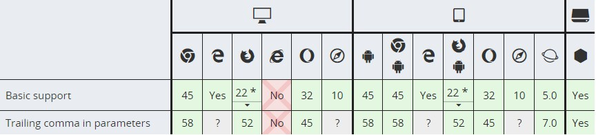

# Note0911


<!-- MarkdownTOC -->

- [箭头函数](#箭头函数)
  - [更短的函数](#更短的函数)
  - [不绑定 this](#不绑定-this)
  - [作为方法使用](#作为方法使用)
  - [不能使用 new 操作符](#不能使用-new-操作符)
  - [没有prototype属性](#没有prototype属性)
  - [函数体](#函数体)
  - [返回字面对象](#返回字面对象)
  - [解析顺序](#解析顺序)
  - [三元运算符](#三元运算符)
  - [立即执行函数](#立即执行函数)
  - [视觉上更加明了](#视觉上更加明了)
  - [闭包](#闭包)
  - [递归](#递归)
  - [版本支持](#版本支持)
- [jQuery $\(\) 的用法](#jquery-$-的用法)
  - [DOM 选择](#dom-选择)
  - [DOM 创建](#dom-创建)
  - [DOM 加载完成事件监听](#dom-加载完成事件监听)
- [快速响应的 click 事件](#快速响应的-click-事件)
- [选择器](#选择器)
- [伪选择器](#伪选择器)
- [flexbox 和其他 CSS 的区别](#flexbox-和其他-css-的区别)
- [DOM 事件传递机制](#dom-事件传递机制)
- [浏览器  缓存敏感。。](#浏览器-缓存敏感。。)
- [license Management sys 遗留问题](#license-management-sys-遗留问题)

<!-- /MarkdownTOC -->


## 箭头函数

```js
(参数1, 参数2, ...,参数N ) => { 函数声明 }
(参数1, 参数2, ..., 参数N) => 表达式
//相当于：(参数1, 参数2, …, 参数N) =>{ return 表达式; }

// 当只有一个参数时，圆括号是可选的：
(单一参数) => {函数声明}
单一参数 => {函数声明}

//没有参数的函数应该写成一对圆括号。
() => {函数声明}

//加括号的函数体返回对象字面表达式：
参数=> ({foo: bar})

//支持剩余参数和默认参数
(参数1, 参数2, ...rest) => {函数声明}
(参数1 = 默认值1,参数2, ..., 参数N = 默认值N) => {函数声明}

//同样支持参数列表解构
let f = ([a, b] = [1, 2], {x: c} = {x: a + b}) => a + b + c;
f();  // 6
```


箭头函数表达式的语法比函数表达式更短，并且没有自己的 this，arguments，super或 new.target。

这些函数表达式更适用于那些本来需要匿名函数的地方，但是它们不能用作构造函数。

引入箭头函数主要有两个方面：更短的函数以及不绑定 `this`

### 更短的函数

```js
var materials = [
  'Hydrogen',
  'Helium',
  'Lithium',
  'Beryllium'
];

materials.map(function(material) { 
  return material.length; 
}); // [8, 6, 7, 9]

materials.map((material) => {
  return material.length;
}); // [8, 6, 7, 9]

materials.map(material => material.length); // [8, 6, 7, 9]
```

### 不绑定 this

在箭头函数出现之前，每个新定义的函数都有它自己的 `this`值（在构造函数的情况下是一个新对象，在严格模式的函数调用中为 `undefined`，如果该函数被作为“对象方法”调用则为基础对象等）。

`this` 被证明是令人厌烦的面向对象风格的编程，会存在各种令人费解的指向不明的问题 :smirk:

```js
function Person() {
  // Person() 构造函数定义 `this`作为它自己的实例.
  this.age = 0;

  setInterval(function growUp() {
    // 在非严格模式, growUp()函数定义 `this`作为全局对象, 
    // 与在 Person()构造函数中定义的 `this`并不相同.
    this.age++;
  }, 1000);
}

var p = new Person();
```

在ECMAScript 3/5中，通过将`this`值分配给封闭的变量，可以解决`this`问题。

```js
function Person() {
  var that = this;
  that.age = 0;

  setInterval(function growUp() {
    //  回调引用的是`that`变量, 其值是预期的对象. 
    that.age++;
  }, 1000);
}
```
或者创建 `bind` 以便将预先分配的this值传递到绑定的目标函数。

箭头函数不会创建自己的 `this`，它只会从自己的作用域链的上一层继承`this`。因此，在下面的代码中，传递给`setInterval`的函数内的`this`与封闭函数中的`this`值相同

```js
function Person(){
  this.age = 0;

  setInterval(() => {
    this.age++; // |this| 正确地指向person 对象
  }, 1000);
}

var p = new Person();
```
### 作为方法使用

箭头函数表达式对非方法函数是最合适的。作为方法使用：

```js
'use strict';
var obj = {
  i: 10,
  b: () => console.log(this.i, this),
  c: function() {
    console.log( this.i, this)
  }
}
obj.b(); 
// undefined
obj.c(); 
// 10, Object {...}
```

### 不能使用 new 操作符

箭头函数不能用作构造器，和 new一起用会抛出错误。

```js
var Foo = () => {};
var foo = new Foo(); // TypeError: Foo is not a constructor
```

### 没有prototype属性

箭头函数没有prototype属性。

```js
var Foo = () => {};
console.log(Foo.prototype); // undefined
```

### 函数体

箭头函数可以有一个“简写体”或常见的“块体”。

```js
var func = x => x * x;                  
// 简写函数 省略return

var func = (x, y) => { return x + y; }; 
//常规编写 明确的返回值
```

### 返回字面对象

```js
var func = () => { foo: 1 };               
// Calling func() returns undefined!
```

这是因为花括号里面的代码被解析为一系列语句（即 foo 被认为是一个标签，而非对象字面量的组成部分）。

记得用圆括号把对象字面量包起来：

```js
var func = () => ({foo: 1});
```

### 解析顺序

```js
let callback;

callback = callback || function() {}; // ok

callback = callback || () => {};      
// SyntaxError: invalid arrow-function arguments

callback = callback || (() => {});    // ok
```

### 三元运算符

```js
var simple = a => a > 15 ? 15 : a;
simple(16); // 15
simple(10); // 10

let max = (a, b) => a > b ? a : b;
```

### 立即执行函数

```js
(() => 'foobar')(); 
// Returns "foobar"
// (这是一个立即执行函数表达式,可参阅 'IIFE'术语表) 
```

### 视觉上更加明了

```js
// 更简明的promise链
promise.then(a => {
  // ...
}).then(b => {
  // ...
});

// 无参数箭头函数在视觉上容易分析
setTimeout( () => {
  console.log('I happen sooner');
  setTimeout( () => {
    // deeper code
    console.log('I happen later');
  }, 1);
}, 1);
```

### 闭包

```js
// 标准的闭包函数
function A(){
      var i=0;
      return function b(){
              return (++i);
      };
};

var v=A();
v();    //1
v();    //2


//箭头函数体的闭包（ i=0 是默认参数）
var Add = (i=0) => {return (() => (++i) )};
var v = Add();
v();           //1
v();           //2

//因为仅有一个返回，return 及括号（）也可以省略
var Add = (i=0)=> ()=> (++i);
 
```

### 递归

```js
var fact = (x) => ( x==0 ?  1 : x*fact(x-1) );
//var fact = (x) => x==0 ? 1 : x*poo(x-1);

fact(5);       // 120
fact(5);       // 120
```

### 版本支持

[](https://developer.mozilla.org/zh-CN/docs/Web/JavaScript/Reference/Functions/Arrow_functions)


## jQuery $() 的用法

[](https://segmentfault.com/a/1190000004003037)
[](https://harttle.land/2015/08/06/jquery-object.html)

### DOM 选择


### DOM 创建


### DOM 加载完成事件监听


## 快速响应的 click 事件


## 选择器


## 伪选择器


## flexbox 和其他 CSS 的区别


```js

updateDevice();
initTestRuntimeSettings();

playvideo();
loopReadVideo(){
    getAndPlayVideo();
}
```


## DOM 事件传递机制

捕获和冒泡

[](https://blog.techbridge.cc/2017/07/15/javascript-event-propagation/)


## 浏览器  缓存敏感。。


## license Management sys 遗留问题

- 主页面元素超出
- 点击后链接保留颜色问题
- button 动效
- button onclick 事件绑定
