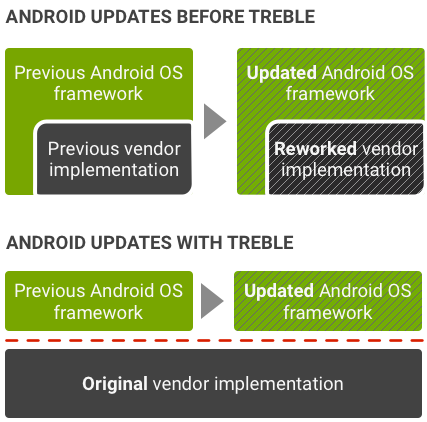

# Note0913


<!-- MarkdownTOC -->

- [Project Treble](#project-treble)
- [jQuuery 判断元素是否存在](#jquuery-判断元素是否存在)
- [时间戳与时间格式之间相互转换](#时间戳与时间格式之间相互转换)
    - [时间戳 -> 时间格式](#时间戳---时间格式)
    - [时间格式 -> 时间戳](#时间格式---时间戳)
    - [Date\(\) 7 种参数形式](#date-7-种参数形式)

<!-- /MarkdownTOC -->


## Project Treble

[](https://www.androidauthority.com/project-treble-818225/)

Project Treble的核心思想是消除重新设计供应商实施的要求，允许OS层独立更新。


## jQuuery 判断元素是否存在

直觉上是：

```js
if( $('#id') ) {}
```
但是无论 `#id` 是否存在，`$('#id')` 都会有返回值，返回的是一个数组，通过判断该数组的`length` ，就能得知元素是否存在。

```js
//element exist
if ( $('#id') > 0 ) {}

//element not exist
if ( $('#id') = 0) {}
```

实际上，如果你想要先判断某个元素是否存在，然后再对它进行某些操作，那么这种情况下判断这个页面元素存在与否在 jQuery 实际上是没有必要的，jQuery本身会忽略对一个不存在的元素进行操作，并且不会报错。


## 时间戳与时间格式之间相互转换

### 时间戳 -> 时间格式

时间戳的类型是 int ，而不是 string ，接收到一个时间戳需要先做如下处理：

```js
if (typeof(_timestamp) == "string"){
    _timestamp = parseInt(_timestamp);
}
```
之前操作 json 文件，就是碰到了这个坑，接下来就是对应转化了：

```js
// 简单的一句代码
var date = new Date(_timestamp); //获取一个时间对象


 // 下面是获取时间日期的方法，需要什么样的格式自己拼接起来就好了
 
date.getFullYear();  // 获取完整的年份(4位,1970)
date.getMonth();  // 获取月份(0-11,0代表1月,用的时候记得加上1)
date.getDate();  // 获取日(1-31)
date.getTime();  // 获取时间(从1970.1.1开始的毫秒数)
date.getHours();  // 获取小时数(0-23)
date.getMinutes();  // 获取分钟数(0-59)
date.getSeconds();  // 获取秒数(0-59)
```

对于月，日小于 10 的时候需要补上 0 的情况，如：`2018-09-13`，作如下处理：

```js
let M = _stamp.getMonth() + 1 < 10 ? '0' + (_stamp.getMonth() + 1) : _stamp.getMonth() + 1;
let D = _stamp.getDate()+ 1 < 10 ? '0' + (_stamp.getDate() + 1) : _stamp.getDate() + 1;
```

### 时间格式 -> 时间戳


```js
// 也很简单
var strtime = '2014-04-23 18:55:49:123';
var date = new Date(strtime); //传入一个时间格式，如果不传入就是获取现在的时间了，这样做不兼容火狐。
// 可以这样做
var date = new Date(strtime.replace(/-/g, '/'));

// 有三种方式获取，在后面会讲到三种方式的区别
time1 = date.getTime();
time2 = date.valueOf();
time3 = Date.parse(date);

/* 
三种获取的区别：
第一、第二种：会精确到毫秒
第三种：只能精确到秒，毫秒将用0来代替
比如上面代码输出的结果(一眼就能看出区别)：
1398250549123
1398250549123
1398250549000 
*/
```

### Date() 7 种参数形式

```js
new Date("month dd,yyyy hh:mm:ss");
new Date("month dd,yyyy");
new Date("yyyy/MM/dd hh:mm:ss");
new Date("yyyy/MM/dd");
new Date(yyyy,mth,dd,hh,mm,ss);
new Date(yyyy,mth,dd);
new Date(ms);
```


```json
{
   "license" : [
      {
         "activetime" : "1536735335",
         "licenseid" : 2,
         "licensekey" : "b1uuue",
         "quota" : 1
      },
      {
         "activetime" : "1536654268",
         "licenseid" : 1,
         "licensekey" : "DWT",
         "quota" : 1
      }
   ],
   "method" : "listlicense",
   "status" : "success"
}
```

