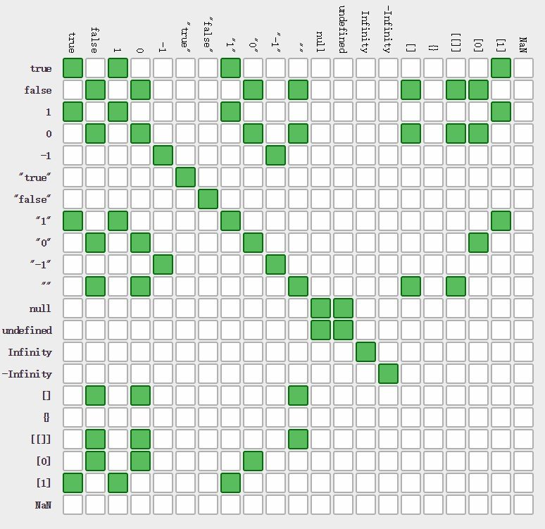

# Note0919


<!-- MarkdownTOC -->

- [=== vs ==](#-vs-)
- [科学计数法转换数字](#科学计数法转换数字)

<!-- /MarkdownTOC -->


## === vs ==

在 js 中 `===` 是身份运算符（identity），首先检查两个参数的类型； `==` （equality）不会检查类型，而是将两个参数隐式尝试转换为相同的类型然后进行比较。

所以一般来说 `===` 的速度比 `==` 的速度快。

```js
0 == '0'   //true
0 === '0'  //false
```
下面是一些常见的例子：

```js
'' == '0'           // false
0 == ''             // true
0 == '0'            // true

false == 'false'    // false
false == '0'        // true

false == undefined  // false
false == null       // false
null == undefined   // true

' \t\r\n ' == 0     // true
```

这是张有趣的图：

[](https://dorey.github.io/JavaScript-Equality-Table/)

有时候我们不知道某个参数的 bool 值，那么我们可以使用的 `!!parameter` 的形式查看：

```js
!!'0'  //true
!!0    //false
!!1    //true
```

更推荐使用身份运算符 `===`

## 科学计数法转换数字

parseInt 

[parseInt](https://developer.mozilla.org/zh-CN/docs/Web/JavaScript/Reference/Global_Objects/parseInt)


