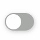
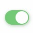

# Note0923

<!-- MarkdownTOC -->

- [一个好看的 check button](#一个好看的-check-button)
    - [js 写法](#js-写法)
    - [css 写法](#css-写法)
- [更多 python 的内容](#更多-python-的内容)
    - [单语句块](#单语句块)
    - [列表综合](#列表综合)
    - [在函数中接收列表和元组](#在函数中接收列表和元组)
    - [lambda 形式](#lambda-形式)
    - [exec 和 eval 语句](#exec-和-eval-语句)
    - [assert语句](#assert语句)
    - [repr 语句](#repr-语句)

<!-- /MarkdownTOC -->


## 一个好看的 check button

[树状文件夹](https://jinlong.github.io/2016/01/14/checkbox-trickery-with-css/)

默认的 checkbox 样式由浏览器定义，通过开放的 api 能对其样式所做的修改十分有限，这时候就会想要通过其他手段改变复选框的样式




### js 写法

第一种思路就是通过 js 切换 checkbox 的 class 从而达到样式切换的效果。

首先先画复选框，注意到 checkbox 是有两层的，下面一层是带圆角的矩形，上面的是个圆形，那么用伪类定义上面的圆形即可。

```html
<input type="checkbox" id="checkBtn" class="checkBtn_disable">
```

定义 checkBtn_disable & checkBtn_enable 以及各自伪类
```css
.checkBtn_disable {
    width: 50px;
    height: 30px;
    border-radius: 30px;
    border: 1px solid #AAAAAA;
    background: #AAAAAA;
    cursor: pointer;
    box-shadow: 1px 2px 10px #CCCCCC;
}

.checkBtn_disable::before {
    display: block;
    margin: 1px 0 0 1px;
    content: '';
    width: 26px;
    height: 26px;
    border-radius: 26px;
    background: #FFFFFF;
}

.checkBtn_enable {
    width: 50px;
    height: 30px;
    border-radius: 30px;
    border: 1px solid #75CA75;
    background: #75CA75;
    cursor: pointer;
    box-shadow: 1px 2px 10px #b4cdb2;
}

.checkBtn_enable::before {
    display: block;
    margin: 1px 0 0 21px;
    content: '';
    width: 26px;
    height: 26px;
    border-radius: 26px;
    background: #FFFFFF;
}
```

下面我们用 jQuery 方式
```js
$('#checkBtn').click(function() {
    if ($(this).attr('class') === 'checkbox_disable') {
        $(this).removeClass('checkbox_disable').addClass('checkbox_enable');
    } else if ($(this).attr('class') === 'checkbox_enable') {
        $(this).removeClass('checkbox_enable').addClass('checkbox_disable');
    }
});
```
添加过度样式我还没有找到有效的解决办法 transition 可以解决嘛 :thinking:

另外还要绑定功能（on off）和 checkbox 样式，一些细节性的东西我都没有再深究，因为我找到更完美的解决方案。 checkbox + label

### css 写法 

能用纯 css 解决的就不要『杀鸡用牛刀』请出 js。 checkbox + label 算是比较经典的用法技巧了吧。

注意 `<input>` 和 `<label>` 标签的先后顺序，因为之后要用到子类选择器 `+` ，我这里就被坑过 :upside_down_face:

```html
<input type="checkbox" id="myBtn">
<label for="myBtn" class="check-btn"></label>
```

transition 属性添加过渡效果，让切换更加 ease
```css
.check-btn {
    display: inline-block;
    vertical-align: middle;
    width: 50px;
    height: 30px;
    border-radius: 30px;
    border: 1px solid #AAAAAA;
    background: #AAAAAA;
    cursor: pointer;
    box-shadow: 1px 2px 10px #CCCCCC;
    transition: 0.5s;
}
.check-btn::before{
    display: block;
    margin: 1px 0 0 1px;
    content: '';
    width: 26px;
    height: 26px;
    border-radius: 26px;
    background: #FFFFFF;
    transition: 0.3s;
}

/*Btn checked bind with the style*/
input:checked + .check-btn{
    width: 50px;
    height: 30px;
    border-radius: 30px;
    border: 1px solid #75CA75;
    background: #75CA75;
    cursor: pointer;
    box-shadow: 1px 2px 10px #b4cdb2;
}
input:checked + .check-btn::before{
    display: block;
    margin: 1px 0 0 21px;
    content: '';
    width: 26px;
    height: 26px;
    border-radius: 26px;
    background: #FFFFFF;
}
```

一般把 `<input>` 隐藏起来，为了更直观看到绑定状态和样式的效果，我们将它 visible 效果如下：

<input type="checkbox" id="myBtn">
<label for="myBtn" class="check-btn"></label>


## 更多 python 的内容


### 单语句块


### 列表综合


### 在函数中接收列表和元组


### lambda 形式


### exec 和 eval 语句


### assert语句


### repr 语句


<style type="text/css">
.check-btn {
    display: inline-block;
    vertical-align: middle;
    width: 50px;
    height: 30px;
    border-radius: 30px;
    border: 1px solid #AAAAAA;
    background: #AAAAAA;
    cursor: pointer;
    box-shadow: 1px 2px 10px #CCCCCC;
    transition: 0.5s;
}
.check-btn::before{
    display: block;
    margin: 1px 0 0 1px;
    content: '';
    width: 26px;
    height: 26px;
    border-radius: 26px;
    background: #FFFFFF;
    transition: 0.3s;
}
input:checked + .check-btn{
    width: 50px;
    height: 30px;
    border-radius: 30px;
    border: 1px solid #75CA75;
    background: #75CA75;
    cursor: pointer;
    box-shadow: 1px 2px 10px #b4cdb2;
}
input:checked + .check-btn::before{
    display: block;
    margin: 1px 0 0 21px;
    content: '';
    width: 26px;
    height: 26px;
    border-radius: 26px;
    background: #FFFFFF;
}
</style>