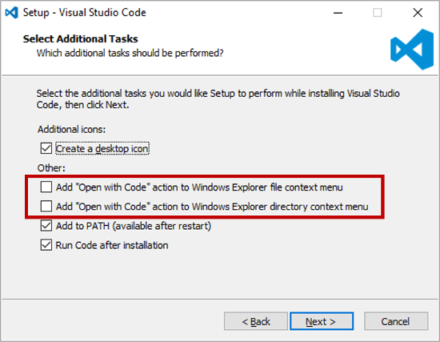

# Note0928

<!-- MarkdownTOC -->

- [Open with VSCode](#open-with-vscode)
- [点击空白的地方收回 dropList](#点击空白的地方收回-droplist)
- [添加滚动条](#添加滚动条)
    - [visible](#visible)
    - [hidden](#hidden)
    - [scroll](#scroll)
    - [auto](#auto)
- [white-space](#white-space)
    - [normal](#normal)
    - [nowrap](#nowrap)
    - [pre](#pre)
    - [pre-wrap](#pre-wrap)
    - [pre-line](#pre-line)
    - [license management sys 遗留问题](#license-management-sys-遗留问题)

<!-- /MarkdownTOC -->

## Open with VSCode

我记得在安装的时候我是勾选了前两个选项的，也就意味着在选中文件后，右键会弹出 opne with VSCode 的选项，但是实际上并没有，这令人失望。

我不知道造成这样的原因是什么，等待下次更新的时候重装，勾选这两个选项。

## 点击空白的地方收回 dropList

为了避免依赖事件捕获和冒泡顺序或者在某个节点中断回流，我有个比较流氓的做法，那就是当下拉框出现的时候，在它底部画个大范围的、不可见的元素，添加对应的 click 事件

## 添加滚动条

[overflow:](https://developer.mozilla.org/en-US/docs/Web/CSS/overflow) _overflow-x_ _overflow-y_

也就意味着可以单独定制横向和纵向的超出部分样式

### visible

内容未被剪裁，可以在填充框外部呈现。

### hidden

如果需要，内容将被剪裁以适合填充框。没有提供滚动条。

### scroll

如果需要，内容将被剪裁以适合填充框。浏览器显示滚动条，无论是否实际剪切了任何内容。（这可以防止滚动条在内容更改时出现或消失。）打印机仍可能打印溢出的内容。

### auto

取决于用户代理。如果内容适合填充框，它看起来相同visible，但仍然建立新的块格式化上下文。如果内容溢出，桌面浏览器会提供滚动条。

## white-space

该 [white-space](https://developer.mozilla.org/en-US/docs/Web/CSS/white-space) CSS属性决定元素中的空白的处理方式。

### normal

白色空间的序列被折叠。源中的换行符处理与其他空格相同。必要时会打破行以填充行框。

### nowrap

折叠白色空间normal，但抑制源中的换行符（文本换行）。

### pre

保留了空白的序列。仅在源和 ` ` 元素中的换行符处断行。

### pre-wrap

保留了空白的序列。线条在换行符，at处 ` ` 和必要时用于填充线框。

### pre-line

白色空间的序列被折叠。线条在换行符，at处 ` ` 和必要时用于填充线框。

attributions | New lines | Spaces and tabs | Text wrapping
------- | ------- | ------- | -------
normal | Collapse | Collapse | Wrap
nowrap | Collapse | Collapse | No wrap
pre Preserve | Preserve | No wrap
pre-wrap | Preserve | Preserve | Wrap
pre-line | Preserve | Collapse | Wrap

### license management sys 遗留问题

- [ ] 文件路径
- [x] 选择文件夹
- [ ] device form

machineid

dd5b-14bc-253-ec73-d1f3

license 

t0068MgAAAFDUftKYkH2IVJkVpsqYyCEOXMDjX2F03ec/mzymHObW4z6mtmbBqE0x9Hmh+vWPaGpMV/mM0uZtcqZUV3QrZIE=