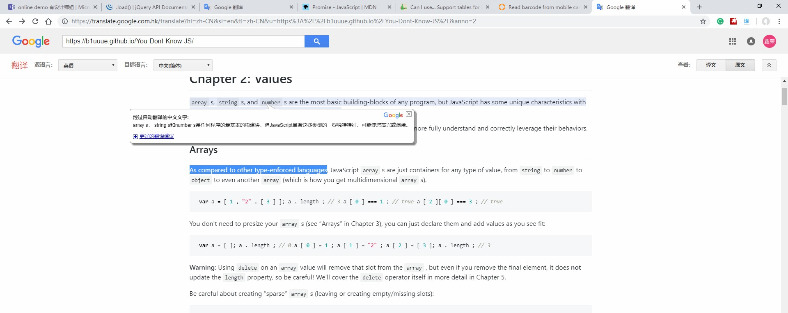
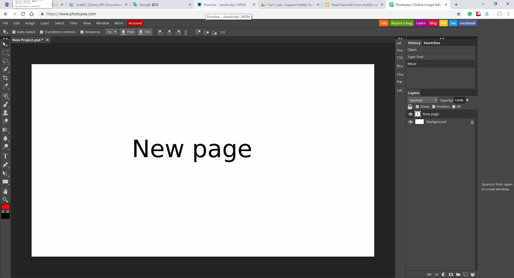
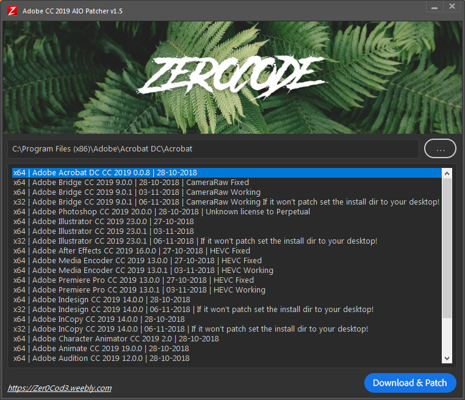

# Note1107

<!-- MarkdownTOC -->

- [Note1107](#note1107)
    - [google translate web page](#google-translate-web-page)
    - [Photopea](#photopea)
    - [Adobe 2019 CC 破解](#adobe-2019-cc-%E7%A0%B4%E8%A7%A3)

<!-- /MarkdownTOC -->

## google translate web page

Google Translate 中输入网页，点击翻译结果中带 `<a>` 标签的 URL ，就会跳转到自带划词翻译的翻译页面。

相比较其他划词翻译 chrome 拓展程序，更加快捷，翻译也更加准确；缺点，就是新页面要重新在 translate.google.com 中输入，阅读连续性不是很好。

## Photopea

我愿称它为 Photoshop Online ，和 office online 有异曲同工之妙。目前能满足绝大多数的 ps 操作，用户免去了安装庞大的 photoshop ，另一个原因是最近采用了新的激活方式的 Adobe CC 2019 更难破解 :kissing:

## Adobe 2019 CC 破解

adobe 终于去掉了我们破解赖以维生的 amtlib.dll ，需要新的激活方式，找个有效的 Adobe CC 2019 Zer0Cod3 Patcher 1.5，找到对应文件目录 -> download&patch btn 即可。

文件地址自行 google 

