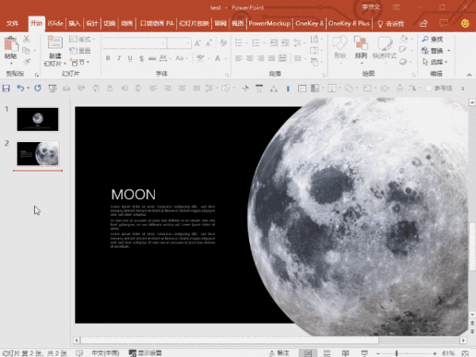

# Note1114

<!-- MarkdownTOC -->

- [幕布](#幕布)
    - [幕布是什么？](#幕布是什么？)
    - [我能用幕布做什么？](#我能用幕布做什么？)
- [ASP.NET 发送带html格式的邮件](#aspnet-发送带html格式的邮件)
- [PowerPoint 插入 3D 模型](#powerpoint-插入-3d-模型)
- [TODO](#todo)

<!-- /MarkdownTOC -->

## 幕布

### 幕布是什么？

幕布是一款以层级折叠式文字来整理内容的大纲文档工具，用更高效的方式和更清晰的结构来记录笔记、管理任务、制定计划等，同时支持一键生成思维导图

### 我能用幕布做什么？

幕布可以是一个传统的文档工具，用来做读书笔记、会议记录和内容创作等

幕布也可以是一个清单工具，管理你的待办事项、购物清单等

幕布还是一个思维导图工具，方便地进行思维整理

[mubu.com](https://mubu.com/)

功能其实很类似我现在使用 markdown + github 的模式，只不过跨平台以及可移植性更强大，功能也更专一，专注于清单的罗列的实现，思维导图的展现也非常惊艳，支持图片，支持分享，很棒了。

## ASP.NET 发送带html格式的邮件

## PowerPoint 插入 3D 模型

插入 -> 3D模型

这还是去年推出的新功能，再加上页面间过渡效果，整体演示效果非常棒

## TODO

- [ ] suervey 返回 result 界面
- [ ] submit 成功提示框 -> 关闭当前页面
- [ ] submit 点击次数限制
- [x] 邮件格式 带所上传的图片