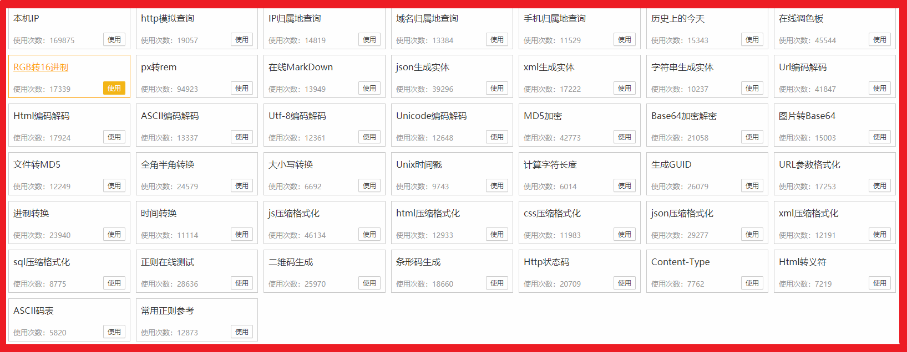

# Note1120

<!-- MarkdownTOC -->

- [illusion](#illusion)
- [ofmonkey](#ofmonkey)
- [中断 javascript 执行](#中断-javascript-执行)
- [Tools](#tools)
    - [Snipaste](#snipaste)
    - [Proxyee-down](#proxyee-down)
    - [ccCleaner](#cccleaner)
    - [PotPlayer](#potplayer)
    - [Officetab](#officetab)
    - [XMeters](#xmeters)
    - [BandZip](#bandzip)
- [浏览器主页被挟持](#浏览器主页被挟持)
- [Getty](#getty)

<!-- /MarkdownTOC -->

## illusion


## ofmonkey

[](http://www.ofmonkey.com/)

常用工具基本都有，很全面了，包括数据查询、前端工具、实体生成、编码解码、加密解密、字符转换、单位换算、代码格式化、正则表达、二维码生成、条形码生成常用参考表。

## 中断 javascript 执行

[使用jQuery中止Ajax请求-stackOverFlow](https://stackoverflow.com/questions/446594/abort-ajax-requests-using-jquery)

大多数jQuery Ajax方法返回XMLHttpRequest（或等效的）对象，因此您可以使用abort()。

中止方法（MSDN）。取消当前的HTTP请求。
abort()（MDN）。如果已经发送了请求，则此方法将中止请求。

abort

```js
var xhr = $.ajax({
    type: "POST",
    url: "some.php",
    data: "name=John&location=Boston",
    success: function(msg){
       alert( "Data Saved: " + msg );
    }
});

//kill the request
xhr.abort()
```

## Tools

### Snipaste

功能改进

- 滚动截屏，类似手机截屏长图，这样可以截取整个网页的内容
- 截屏拼图（之前碰到 CTF 题目拼接二维码）相当于完成了一个简化版的 ps 工作
- 截屏图片内的文字内容，输出可复制文本（OCR）

### Proxyee-down

Badidu 网盘下载不限速

### ccCleaner

电脑清理工具

### PotPlayer

从暴风影音到迅雷看看，到QQ影音，再到PotPlayer，还是Pot的体验最好。

首先启动速度贼快就比较舒服，因为它所占内存比大多数视频播放软件都小。

### Officetab

绝对是 office 拓展神器之一，在一个窗口中能够打开多份文件，切换组织管理更加方便，重命名操作也更加顺畅。

### XMeters

清理进程

### BandZip

解压软件，自动解压到新文件夹，图片快速预览

## 浏览器主页被挟持

在某次安装软件之后，每次打开 chrome 都会打开 `http://gonews.pro/?dk71` 就让我很难受 :disappointed: ，自然想办法去掉这个劫持

检查了 chrome settings -> 启动时 还是原来的设置，打开新的标签页。检查了下，改为打开特定网页，怀疑是否藏在这里面，发现几个 hao123 的网页就没其他了。

这时我点击状态栏上的 chrome 图标，启动时还是会打开 `http://gonews.pro/?dk71` ，那我就开始怀疑是不是将打开首页参数改到了快捷方式里，于是从任务栏取消固定，再重新固定，从状态栏点击启动 chrome ，发现就这么好了，那个烦人的网页消失了 :kissing:

浏览器主页劫持居然还加到了启动的快捷方式上，绝了

## Getty

sU


